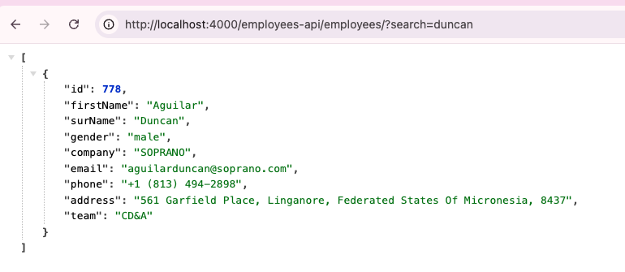
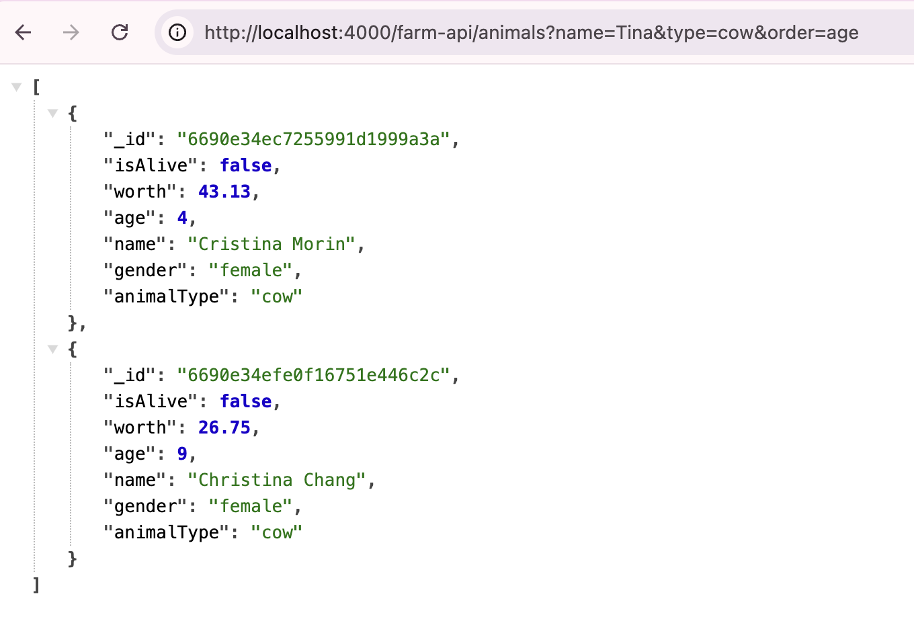

# Welcome to the Supporting APIs for TypeScript Fundamentals

This project was created to support https://github.com/DuncanEdwards/ts-fundamentals

## Available Scripts

In the project directory, you can run:

### `npm start`

Runs the app in the development mode.\
Open [http://localhost:4000](http://localhost:4000) to view it in the browser.

## What apis are supported

### Employees API

`GET /employees-api/employees`\
It can also be called with an optional `search` query string parameter:

\
which does a case insensitive search on first name, surname and address.

### Farm Challenge API

`GET /farm-api/animals`\
Can be called with the following params:
`GET /farm-api/animals?name=Tina&type=cow&order=age`\
which allows filtering by:

- name
- type
  and sorting (ASC) by any animal property:
  

`GET /farm-api/animal-types`\
(no querystring params)

`GET /farm-api/animal-sort-options`\
(no querystring params)
